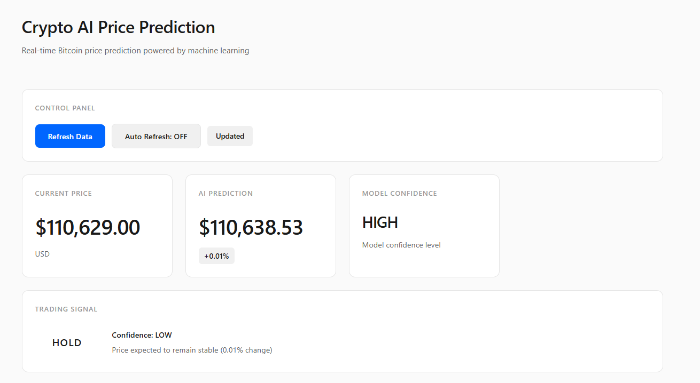

source: https://www.coingecko.com/learn/crypto-price-prediction-ai-model

# AI Crypto Price Prediction System

An AI-powered cryptocurrency price prediction system that uses Node.js and Python. This project fetches historical market data from the CoinGecko API, trains a machine learning model (Linear Regression), and serves real-time price predictions via a REST API.

## Key Features

* **Automated Data Collection**: Fetches historical market data from CoinGecko.
* **Machine Learning Model**: Trains a Linear Regression model to predict prices.
* **REST API**: Provides an endpoint to get real-time price predictions.
* **Trading Signals**: Generates basic trading signals (BUY, SELL, HOLD) based on prediction results.
* **Isolated Environments**: Uses a Python virtual environment and `npm` dependencies.

## Tech Stack

* **Backend**: Node.js, Express.js
* **Machine Learning**: Python, scikit-learn, pandas, numpy
* **API Client**: Axios (Node.js), Requests (Python)
* **Environment Management**: `dotenv`, `venv`

## Project Structure

```
defi-ai-project/
├── data_collector.py      # Script to fetch historical data
├── ai_model.py           # AI prediction model
├── index.js              # Express server with API endpoints
├── package.json          # Node.js dependencies
├── .env                  # Environment variables (API Key, Port)
├── market_data.csv       # Generated data file
└── venv/                 # Python virtual environment
```

## Setup and Run Guide

### 1. Prerequisites

* Node.js (v14+)
* Python (3.7+)
* CoinGecko API Key ([Get one here](https://www.coingecko.com/en/api))

### 2. Project Setup

```bash
# Clone or create the project directory
mkdir defi-ai-project
cd defi-ai-project

# Setup Python Environment
python -m venv venv
source venv/bin/activate  # or venv\Scripts\activate on Windows
pip install numpy pandas scikit-learn requests python-dotenv

# Setup Node.js Project
npm install express axios dotenv
```

### 3. Configuration

Create a `.env` file in the root directory and add the following configuration:

```
COINGECKO_API_KEY=your_actual_api_key_here
PORT=3000
```

### 4. Running the Project

1. **Fetch Historical Data** (run in a terminal with the venv activated):
```bash
python data_collector.py
```

2. **Run the API Server**:
```bash
node index.js
```

3. **Test the API** (open a new terminal):
```bash
curl http://localhost:3000/predict_price
```

## API Endpoints

* `GET /predict_price`: Gets the current price, AI price prediction, and a trading signal.
* `GET /health`: Performs a server health check.
* `GET /`: Displays basic API documentation.

## Disclaimer

⚠️ **This project is for educational purposes only.** Cryptocurrency trading carries significant risk. Do not use this system for actual trading without conducting thorough research and proper risk management.

---
